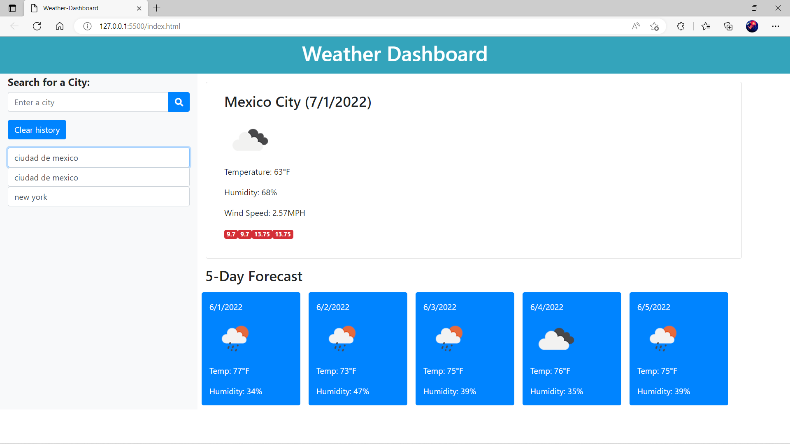

# Server-Side APIs: Weather Dashboard

## Description of the activity

In this page you can search a city with form inputs.

Shows the city weather in current and future conditions and that city is added to the search history.

Shows the city name, the date, an icon representation of weather conditions, the temperature, the humidity, the wind speed and the UV Index.

With a color indicates if the weather conditions are favorable, moderate or severe.

Show the future weather conditions with a 5-day forecast that display the date, an icon representation of weather conditions, the temperature, the wind speed and the humidity.

When I click on a city in the search history it shows again the current and future conditions for that city.

## Screenshoot

## Page link

[Page link](https://davidtrujillor.github.io/Weather-Dashboard/)
